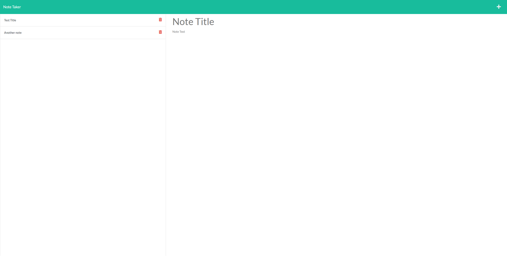

# Express-Note-Taker

## Table of Contents
1. [Description](#description)
2. [Visuals](#visuals)
3. [Resources](#resources)

## Description
- Express js application to add notes to the website.
- Notes will be added dynamically whenever the user inputs a new note.
- Previous notes that have been inserted are then clickable and clicking on an old note will display it's content.
- Feel free to delete each note once you have accomplished whatever it is you set for your note.

## Visuals

## Resources

[Repository](https://github.com/ntraugh/Express-Note-Taker)

[Deployed Site](https://boiling-journey-42918.herokuapp.com/)